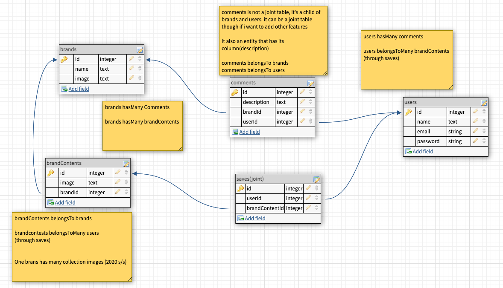

# fash-un-frontend
Solo Project 3 (Frontend)

## Fash-un App
**Fashion show coverage app**

## About this app
**Fash-un App is a fashion show coverage where you can explore runway shows, and create mood boards to save inspiring looks**

## Wireframes

Click to see wireframes

## User Stories

- When I go onto the first page, I see homepage,login and signup buttons.
- I can sign-up with name, email, password, username.
- When I login all brand covers are shown, I can filter this list using a search bar, there are my mood board, sign-out and profile buttons. 
- When I click a brand, it redirects me to another page and shows this brand's fashion show images.
- I can see a comment section where I can leave comments and see other's comments.
- If I click an image, it shows me a detail look and there is a save button.
- I can go to my board and see my saved images with delete buttons.
- In my profile page, I can see pre-populated profile info, and I can edit/delete my profile.

## Frontend components tree
## ERD

Click to see ERD

## HTTP Routes

Click to see

[Users]

| Method | Path                   | Purpose                     | Note                       |
|--------|------------------------|-----------------------------|----------------------------|
| GET    | /users                 | Get user profile info       | use auth headers for userId|
| GET    | /users/moodboard       | Get saved mood board        | use auth headers for userId|
| POST   | /users                 | Sign-up                     |
| POST   | /users/login           | Log-in                      |
| PUT    | /users/profile         | Edit user profile info      | use auth headers for userId|
| DELETE | /users/                | Delete user account         | use auth headers for userId|

[Brand] * /:id/ refers to the id of whatever that comes before /:id/ *
| Method | Path                   | Purpose                         | 
|--------|------------------------|---------------------------------|
| GET    | /brands                | Get brand list from api         | 
| GET    | /brands/:id            | Brand contents and comments     |  
| POST   | /brandContent/:id      | User can save images            |
| DELETE | /brandContent/:id      | User can delete saved images    |

[Comment]
| Method | Path                   | Purpose                         |
|--------|------------------------|---------------------------------|
| POST   | /brand/:id/comments    | Leave comments                  |

## MVP checklist 
- Can I sign up, sign in and sign out?
- Can I see all brand list and its contents?
- Can I see my board? (save brand contents, list it in my board)

### Stretch goals
- Can I find a brand through search bar?
- Can I leave comments and see them?
- Can I edit and delete my comments?
- Can I see my profile and edit/delete it?

## Work flow

Click to see 

1. Work on backend and frontend synchronously.
2. Setup (react dependencies, sequelize, express, etc)
3. Make database, add constraints/validations, associations.
4. Set front/backend servers and run them.
5. Controllers and Routers in backend.
6. All functionalities in frontend using(context, components, props)
7. CRUD 
     
[Create]

    - Signup
    - Signin
    - Save brand images  
    - Leave comments 

    
[Read]

    - All brand list
    - Collection images(single brand view)
    - Detail view(single photo)
    - User profile info
    - Mood board(saved images)
    - All comment list

    
[Update]

    - User profile info edit

    
[Delete]

    
    - Delete user account
    - Delete images from mood board 

8. Signout functionality.
9. Styling up browser with CSS.

## Credit
### API
### Photos